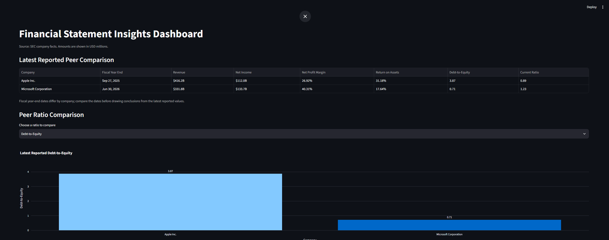

# Financial Statement Insights Dashboard

**[Open the live dashboard](https://gregory-financial-statement-insights-a9fgkvpsxcyho4kkiezn64.streamlit.app/)**

An interactive Python dashboard that retrieves SEC filing data, calculates financial ratios, and compares public companies using the latest reported annual financial statements.

## Overview

This project analyzes Apple Inc. and Microsoft Corporation using SEC Company Facts data. It automates the pipeline from raw XBRL financial facts to a cleaned peer-comparison dataset and presents the results in a Streamlit dashboard.

The dashboard provides:

* A latest-reported peer comparison table
* A selectable peer ratio comparison chart
* Company-specific financial ratio cards
* Revenue and net income charts
* Automatically generated financial takeaways
* Exact fiscal-year-end dates to clarify reporting-period differences

## Dashboard Preview



## Data Pipeline

```text
SEC Company Facts API
        ↓
Raw JSON files
        ↓
Cleaned company financial CSVs
        ↓
Combined peer-comparison CSV
        ↓
Streamlit dashboard
```

## Financial Metrics

The dashboard calculates:

* Net Profit Margin
* Return on Assets
* Debt-to-Equity
* Current Ratio
* Revenue Growth
* Net Income Growth

## Technology Used

* Python
* pandas
* requests
* Plotly
* Streamlit
* SEC EDGAR Company Facts API

## Project Structure

```text
financial-dashboard/
├── data/
│   ├── raw/
│   │   ├── apple_companyfacts.json
│   │   └── microsoft_companyfacts.json
│   └── processed/
│       ├── apple_financials.csv
│       ├── microsoft_financials.csv
│       └── peer_financials.csv
│
├── src/
│   ├── build_financials_csv.py
│   ├── combine_financials.py
│   ├── download_company_facts.py
│   └── ratio_calculator.py
│
├── app.py
├── README.md
└── requirements.txt
```

## How to Run

1. Create and install dependencies in a virtual environment:

```powershell
py -m venv .venv
.\.venv\Scripts\python.exe -m pip install -r requirements.txt
```

2. Add your contact email to the `User-Agent` header in `src/download_company_facts.py`.

3. Download SEC company facts:

```powershell
.\.venv\Scripts\python.exe src\download_company_facts.py --cik 320193 --slug apple
```

```powershell
.\.venv\Scripts\python.exe src\download_company_facts.py --cik 789019 --slug microsoft
```

4. Build cleaned financial datasets:

```powershell
.\.venv\Scripts\python.exe src\build_financials_csv.py --input data/raw/apple_companyfacts.json --output data/processed/apple_financials.csv
```

```powershell
.\.venv\Scripts\python.exe src\build_financials_csv.py --input data/raw/microsoft_companyfacts.json --output data/processed/microsoft_financials.csv
```

5. Combine the datasets:

```powershell
.\.venv\Scripts\python.exe src\combine_financials.py
```

6. Start the dashboard:

```powershell
.\.venv\Scripts\python.exe -m streamlit run app.py
```

## Important Methodology Note

Apple and Microsoft have different fiscal year-end dates. The dashboard displays the exact period end for each company because the latest reported values may not represent identical calendar periods.

## Future Improvements

* Add additional peer companies
* Add three- to five-year historical trends
* Add free cash flow and valuation metrics
* Add automated tests for financial calculations
* Deploy the Streamlit dashboard publicly

## Data Source

Financial data is retrieved from the U.S. Securities and Exchange Commission’s EDGAR Company Facts API.

## Resume Bullet

Built and deployed a Python and Streamlit financial-analysis dashboard that automates SEC filing ingestion, XBRL fact extraction, financial-ratio calculation, and live peer comparison for Apple and Microsoft.
